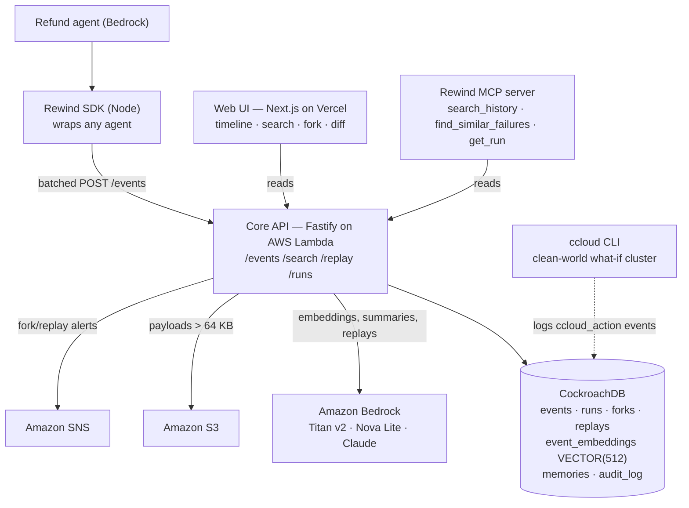

# Rewind

Time-travel debugging for AI agents. Rewind records every decision an agent makes as an
append-only row in CockroachDB. From there you can fork any past decision, change the memory or
context the agent had at that moment, and replay it forward through Amazon Bedrock to see what it
would have done differently. It also shows you that your edit, not model randomness, is what
changed the outcome.

Live app: **https://rewind-agents.vercel.app**

Demo video: #TODO add demo later

---

## The problem it solves

An agent misbehaves in production. It pays the wrong customer, acts on a poisoned memory, or
follows a prompt injection. You get a log line and no good way to ask "what if that one input had
been different?" short of redeploying to prod and hoping.

The demo is a refund agent that makes its decisions with a Claude model on Amazon Bedrock, wrapped
in the Rewind SDK so every step it takes lands in CockroachDB. One `memory_write` records a
"verified" ownership fact, that order A-9 belongs to customer 1002 (Jane). It's false. The real
owner is 1001 (John). The agent applies its rules correctly to the bad fact and refunds **$4,200 to
the wrong customer**. The agent wasn't broken; the data it trusted was.


## The core loop

1. **Record.** A small SDK (`packages/sdk-node`) wraps the agent. Every LLM call, tool call, tool
   result, and memory read/write becomes an event. Events are batched, POSTed to the API, and
   written to CockroachDB as append-only, content-addressed rows. Nothing is ever updated or
   deleted.

2. **Search.** Every event is embedded (Amazon Titan v2, 512 dims) and indexed in CockroachDB's
   distributed vector index. You can search "every time it tried to refund over $500" across every
   run and jump straight to the moment.

3. **Fork.** Right-click the poisoned `memory_write`, change the value (1002 → 1001), and submit.
   That creates a new run which shares events 0..N-1 with the parent and diverges from the fork
   point.

4. **Replay.** The API re-runs the agent's program from the fork with the edited memory, through
   Bedrock, at `temperature = 0`. Side-effecting tools like `issue_refund` are routed to a sandbox,
   so no real money moves.

5. **Prove.** Every fork fires two replays: a **control** (original memory, no edit) and the
   **edited** one. Both get diffed against the original. If the control reproduces the original
   outcome, the run is deterministic, and any difference in the edited replay comes from your edit.
   The `/compare` view shows this in a banner.

### Why the replay is trustworthy

An LLM replayed with no change can still drift, so "edit and replay" on its own proves nothing.
Rewind handles that three ways.

- **Pinned decoding.** Replays run at `temperature = 0`. Claude on Bedrock has no seed parameter,
  so temperature is the only decoding lever, which is why the control replay (not a seed) is what
  establishes reproducibility.
- **The control replay.** It runs the fork context with no edit. If it matches the original, the
  edited replay's divergence is down to the edit. If the control itself drifts, the UI says so
  instead of pretending otherwise.
- **Content addressing.** Each event stores a SHA-256 of its canonical payload, so the diff can
  tell a genuinely new event from the same event shared across a fork.

### What replay covers

Recording works for any agent. The SDK instruments anything, and the timeline, search, diff, and
multi-tenancy all work on whatever it records. Replay is narrower, because running an agent forward
means re-executing its control loop, and a trace doesn't contain that. So replay runs the agent
programs Rewind drives directly, starting with the refund agent. Runs from other agents are still
recorded and searchable, and the run page says so rather than offering a replay it can't do.
Opening replay up to any agent through a registration API is the first item on the
[Roadmap](#roadmap).


## Architecture



CockroachDB is the only primary datastore. The full schema lives in
[`db/schema.sql`](db/schema.sql). A couple of decisions worth calling out: `events` is
hash-sharded on `(run_id, seq)` so writes for one run don't hotspot a single range, and
`event_embeddings` is kept in its own table so embeddings can be regenerated without touching the
timeline. `memories`, `forks`, `replays`, and `audit_log` fill in the rest.


## CockroachDB tools used

We use three of the four eligible tools (the minimum is two).

**Distributed Vector Indexing.** Each event's embedding lives in `event_embeddings` as
`VECTOR(512)`, with a `CREATE VECTOR INDEX ... vector_cosine_ops` index. `/search` embeds the query
and runs a cosine top-k against it. The index currently holds **895,416 embeddings** across 901,216
events, and a warm search comes back in about **58 ms** round-trip (EXPLAIN ANALYZE puts the engine
time near 39 ms). We checked the plan to be sure it uses the index rather than scanning. Building
an index that size on a Basic cluster isn't free; the bulk-load approach (drop the index, load,
rebuild once) is in [`packages/api/scripts/backfill.mjs`](packages/api/scripts/backfill.mjs). The
search runs the vector top-k in a CTE first so the planner picks the index instead of scanning and
then sorting.

**ccloud CLI.** An "infra agent" in
[`packages/api/scripts/ccloud-showcase.mjs`](packages/api/scripts/ccloud-showcase.mjs) spins up an
isolated CockroachDB cluster for a clean-world what-if (`ccloud cluster create serverless …
--cloud AWS`) and then tears it down (`ccloud cluster delete --force`). Each command is logged to a
real timeline run as a `ccloud_action` event. It's a one-shot script and stays out of the replay
path, since provisioning takes a few minutes.

**Agent Skills.** [`packages/skills`](packages/skills) ships three: `rewind-self-instrument` (how
an agent emits its own events), `cockroach-memory-patterns` (idempotent, region-aware memory
writes), and `postmortem-writer` (walk a failed run's timeline and draft a postmortem).

Rewind also exposes itself over MCP ([`packages/mcp-server`](packages/mcp-server):
`search_history`, `find_similar_failures`, `get_run`), so an MCP client like Claude Code or Cursor
can query an agent's history. That's a Rewind feature built on MCP, separate from the four eligible
CockroachDB tools above.


## AWS services used

Four services (the minimum is one).

**Amazon Bedrock.** Titan Text Embeddings V2 (`dimensions: 512`) embeds every event, Nova Lite
writes the one-line summaries, and Claude Sonnet 5 drives the replays at `temperature = 0` (the
model is set by env var, so Haiku 4.5 works as a cheaper option while iterating). Replay cost comes
from actual token usage, and a single investigation runs about three cents.

**AWS Lambda.** The Fastify API runs on Lambda through `@fastify/aws-lambda` behind a Function URL,
and scales to zero. Replays happen inside the same request (20 to 40 seconds, well under the Lambda
limit). A warm handler plus an EventBridge Scheduler ping keep cold starts off the demo path.

**Amazon S3.** Payloads over 64 KB go to S3, since CockroachDB caps a message at 16 MiB. The row
keeps a summary and an `s3_overflow` pointer.

**Amazon SNS.** Every fork/replay publishes an incident alert to an SNS topic (a no-op unless
`SNS_TOPIC_ARN` is set), so an investigation shows up in an inbox.


## Running it locally

Prerequisites: Node >= 20, pnpm, a CockroachDB Cloud Basic cluster (v25.2+ for vector indexing), and
AWS credentials with Bedrock access in `us-east-1`.

```bash
pnpm install

cp .env.example .env
# Fill in at least DATABASE_URL, AWS_ACCESS_KEY_ID, AWS_SECRET_ACCESS_KEY.
# See the comments in .env.example for the rest.

pnpm db:apply        # applies db/schema.sql through a real pgwire client
```

One gotcha on the schema: vector indexes on CockroachDB Basic have to be created through a pgwire
client with the declarative schema changer. The Cloud SQL console forces the legacy schema changer,
which can't build them. `pnpm db:apply` does it the right way, so don't paste the schema into the
console.

```bash
pnpm dev:api         # terminal 1: API on http://localhost:3000
pnpm dev:web         # terminal 2: web UI (Next.js picks the next free port, e.g. http://localhost:3001)
pnpm agent:demo      # terminal 3, once the API is up: runs the refund agent, streaming events into CockroachDB
```

Optional:

```bash
pnpm backfill                                   # synthetic vectors to grow the index (BACKFILL_COUNT env)
node --env-file=.env packages/api/scripts/measure.mjs   # print the real event count + measured search latency
pnpm --filter @rewind/api ccloud:showcase       # dry-run the ccloud what-if (add --live to actually provision)
pnpm --filter @rewind/api test                  # unit tests (hashing, cost, auth) — 13 of them
```

The numbers on screen are reproducible. `measure.mjs` prints the live `count(*)` and the
vector-search latency from `EXPLAIN ANALYZE`, and replay cost comes from real Bedrock token usage.

### Access control

Rewind is multi-tenant, with a hierarchy. `REWIND_API_KEYS` is a comma-separated list of
`key:org[:agent][:role]` entries. A `key:org` entry is a company admin that sees every sub-agent in
that org; a `key:org:agent` entry is a member scoped to one sub-agent, and cross-org access is always
denied. Leave it empty for local dev (auth off, unscoped). Reads, writes, search, recall, and stats
are all scoped the same way, and every fork/replay/edit is written to `audit_log`.

The third role, `demo` (`key:org::demo` — the empty slot means org-wide), exists because the web
app's key is published whether you like it or not: Next.js inlines `NEXT_PUBLIC_*` into the browser
bundle at build time. A demo key reads and replays but **cannot write events or create runs**, so a
scraped key can't forge timeline history. Replays are real Bedrock spend, so demo callers also share
rolling budgets (`REPLAY_DEMO_HOURLY_USD_CAP` / `REPLAY_DEMO_DAILY_USD_CAP`, default $0.25/hr and
$2.00/day) enforced against actual recorded `replays.cost_usd` — two windows because at ~$0.0055 a
replay an hourly-only cap still permits ~$24/day. Admin keys are uncapped, so an exhausted budget can
never lock the operator out mid-demo. An unrecognised role drops the entry rather than defaulting to
admin.


## Roadmap

The core is in place: durable event capture, semantic search over the vector index, forking, and
attributable replay with a control run. Here's where it goes next.

1. **Open replay to any instrumented agent.** A registration API so any team can make their agent
   replayable by declaring its entrypoint, the memory keys editable at a fork, and its
   side-effecting tools:

   ```ts
   Rewind.registerAgent("refund-bot", {
     handler: runMyAgent,            // the agent's own loop, re-driven on replay
     editableKeys: ["order:*:owner"],
     sandboxTools: ["issue_refund"], // routed to mocks during replay, never real side effects
   });
   ```

   The replay worker dispatches by `agent_slug`, so adding an agent is a registration rather than a
   code change.

2. **Record-replay determinism (a VCR pattern).** Serve recorded, content-addressed tool results
   for the steps before the fork so the agent sees identical inputs, and only hit the live model
   and tools after the fork, with side effects sandboxed. This tightens attribution further.

3. **Framework adapters.** LangGraph, CrewAI, Bedrock Agents, and OpenAI Assistants expose their
   control loop as a graph you can inspect, so Rewind can reconstruct and re-drive it without
   per-customer glue.

4. **Reach and scale.** A Python SDK for LangChain, a hosted MCP mode, a scheduled embedding
   worker, and multi-region homing (`REGIONAL BY ROW` on `runs`/`events`) for a one-database,
   no-export story.

Where it's headed: an always-on recorder and incident-response tool for production agents.
Root-cause search across past decisions, a fix you can verify before you ship it, and a regression
suite where every past incident is a replayable test.

---

## License

Apache-2.0 — see [LICENSE](LICENSE).
